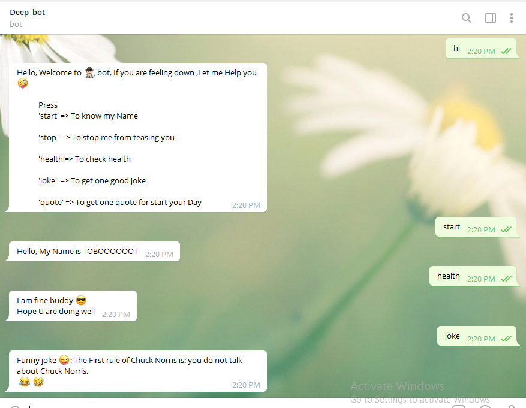

# Telegram_bot

I am introducing this telegram bot which can introduce himself when you say hi to him. This bot can send you inspirational quotes and funny jokes to you when you press certain commands and also instruct you if you press any wrong key. 





# Getting Started 🚀

These instructions will get you a copy of the project up and running on your local machine.


## How To Use 🔧

From your command line, first clone the project:

```bash
# Clone this repository
$ git clone https://github.com/Deepakdanger/Bot_Project.git

# Go into the folder telegram_bot
$ cd Bot_Project

# Install the required gem file
$ bundle install

# In command prompt, run the following command
$ ruby bin/main.rb


# Go to telegram app Desktop/Mobile

# Search for
     
     @deep_tob_bot , Deep_bot

  
Start the chat by saying 'hi','Hi','🤚','👋','✋','🖐'

and enjoy by writing any commands and follows instruction
```


## How To Run the test 🔧

From your command line, first clone the project:

```bash

# In command prompt, run the this command to test
$ rspec

```


## Tools and technology used

- Ruby 2.7.x
- Telegram (BotFather) BOT API
- Quotes API
- Joke API


## CONTRIBUTOR

​
👤 **Deepak Kumar**

- [Github](https://github.com/Deepakdanger)


# Github link:

For the: [Github-link](https://github.com/Deepakdanger/Bot_Project)


## Show your support

Give a ⭐️ if you like this project!

## Acknowledgments

- Thanks to Microverse and The Odin Project.
